# ShopBridge 
ShopBridge Java Spring Boot Project as part of ThinkRidge Challenge

## Postman Output
* Base URL: "/api/inventory"
* All Input formant are JSON
* All Output format is JSON
* Limitation: Only below URL works, using other URL can return wrong result or custom error message

### 1. Add new item to inventory
* Request URL: POST | "/api/invemtory/item/add"

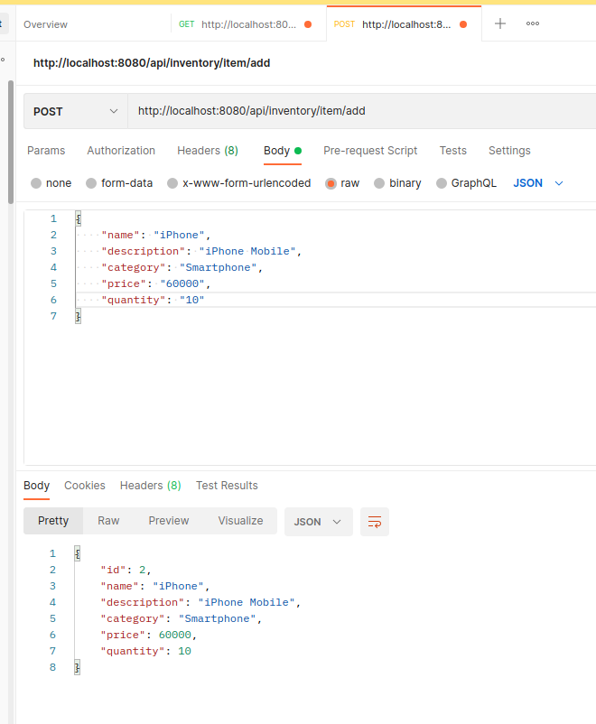

### 2. Display all items from inventory
* Request URL: GET | "/api/inventory/items"

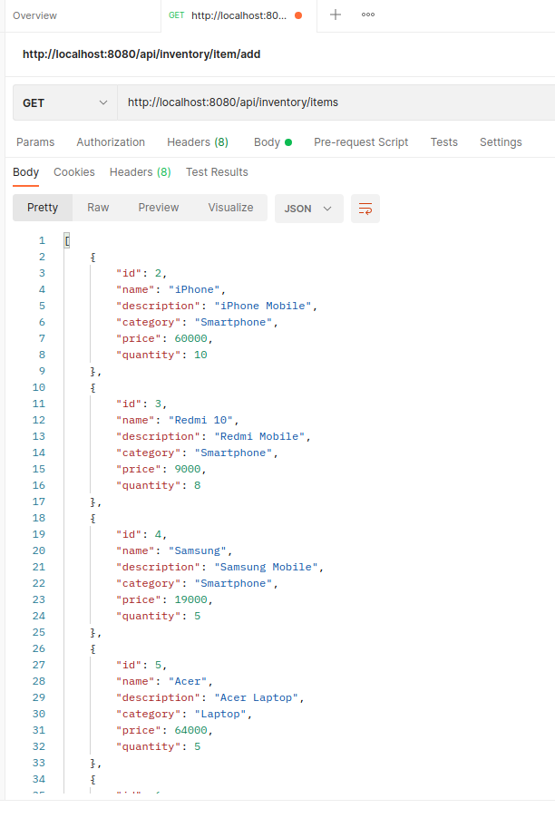

### 3. Get a single item using item id
* Request URL: GET | "/api/inventory/item/<valid_id>"

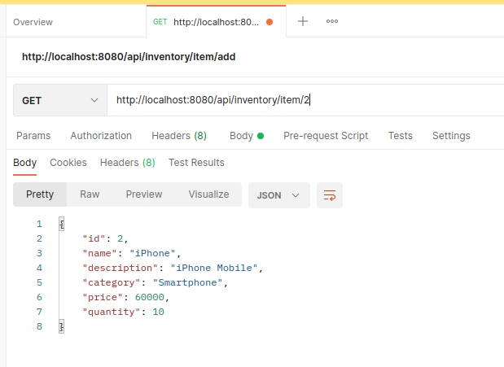

### 4. Custom error response for non-existing item id
* Request URL: GET | "/api/inventory/item/<invalid_id>"

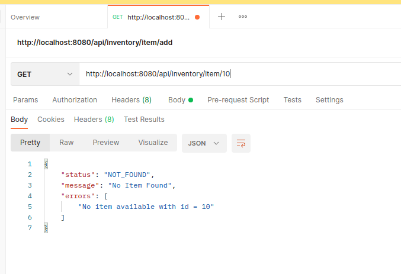

### 5. Update an existing item
* Request URL: PUT | "/api/inventory/item/update"

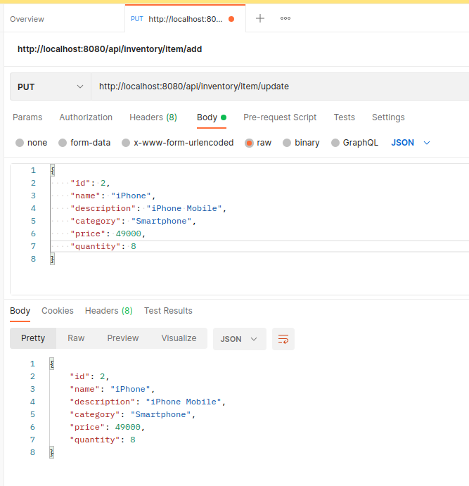

* Request URL: PUT | "/api/inventory/item/update/5"

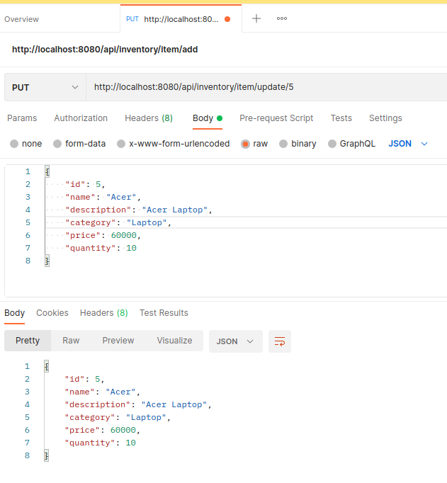

### 6. Custom error message for passing invalid details in update
* Request URL: PUT | "/api/inventory/item/update"

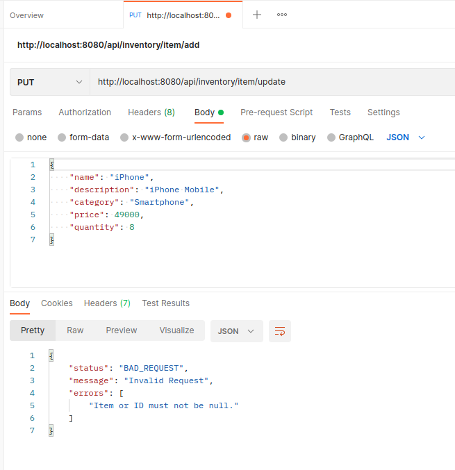

### 7. Delete an existing item
* Request URL: "/api/inventory/item/delete/<id>"

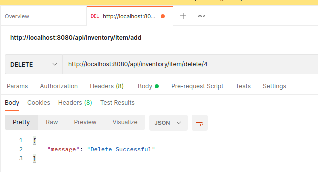

### 8. Search for item using name
* Request URL: GET | "/api/inventory/query?name=\<name>"

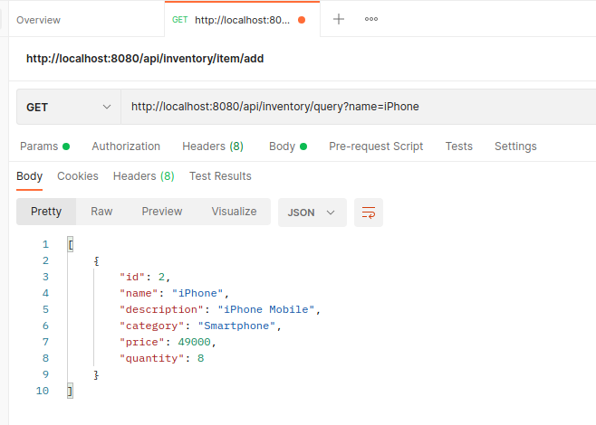

### 9. Search for item using category
* Request URL: GET | "/api/inventory/query?category=\<category>"

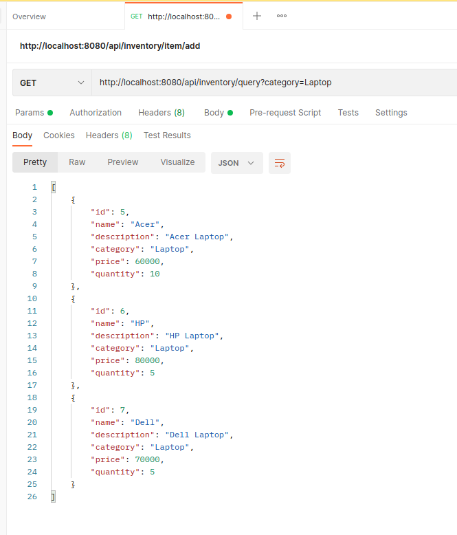

### 10. Search for item using category and maxPrice
* Request URL : GET | "/api/inventory/query?category=\<category>&maxPrice=\<price>"

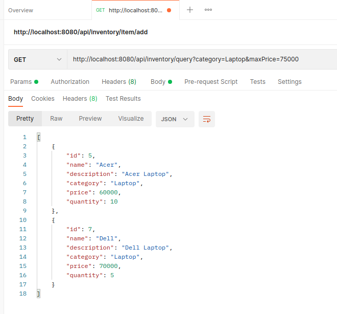

### 11. Database Output
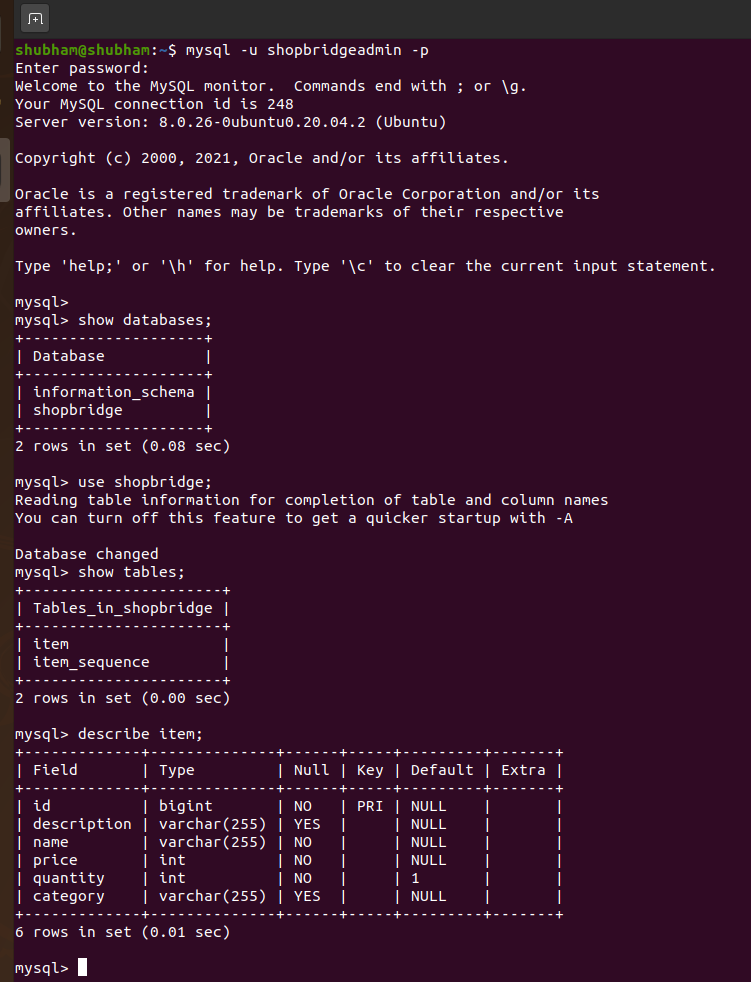
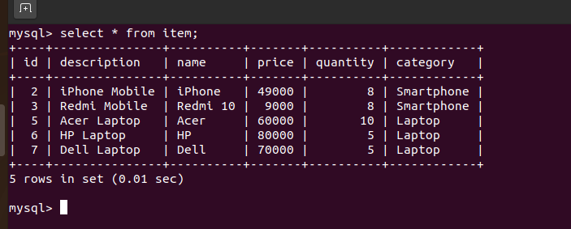